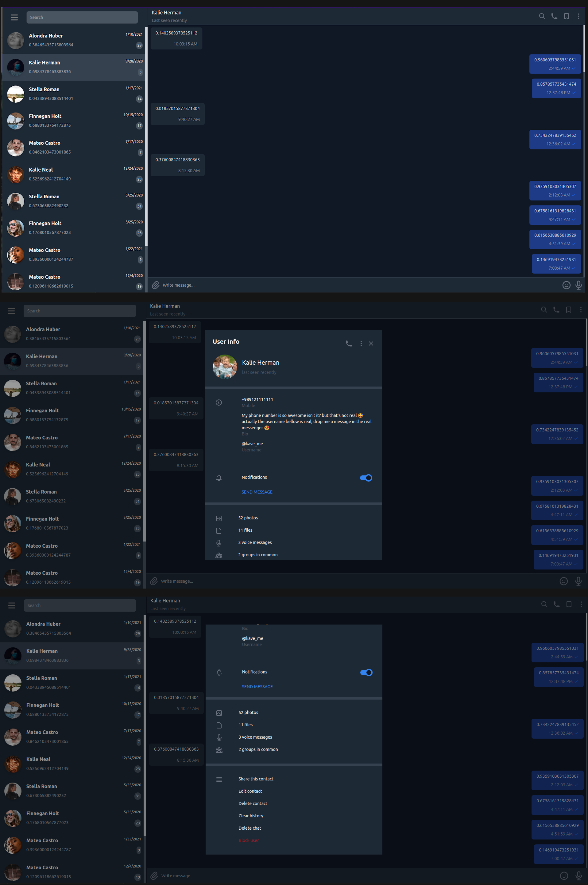
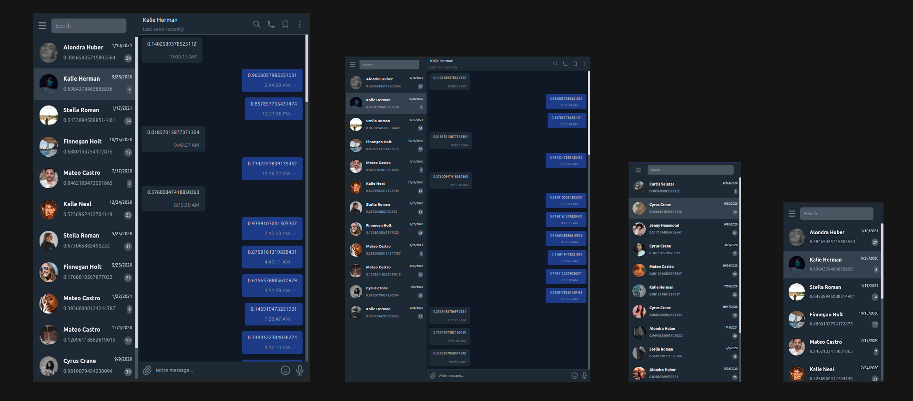

# Chat App - Test Task
This is a React app as a technical task.
## Demo
Hosted [in Vercel](http://telegram-clone-react-kave.vercel.app/)

## Given Task
>As we discussed, the task title would be "Telegram Chats List, Chat Page, and Contacts".
>
>Chat Page: A page with a list of messages, header with a profile picture, and one input in the bottom and a button for sending the message, after sending a message a reply will be shown in the list after 2 seconds, if you click on the header you will see user details.
>
>
>
>Chat List: A page with some chats that is like the first page of the telegram, a profile picture, and last message on that chat, if you click on one chat item you will navigate to the chat page.
>
>
>
>Contacts: A page with a list of contacts, with a profile picture and names. If you click on one of them you will navigate to Contact Info Page and you will see a message button, and if you click on message button in user info page you will navigate to chat page
>

### Start the project
```bash
yarn install
yarn start
```
## Actual Implementation





#### TODO
- Sending message
- Receiving a reply message after 2 seconds
- Add chat page in small devices
- Add contact section
- show menu after clicking on hamburger icon
